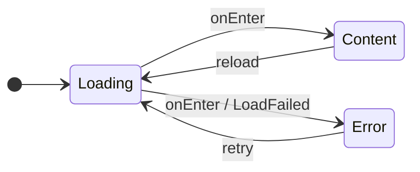
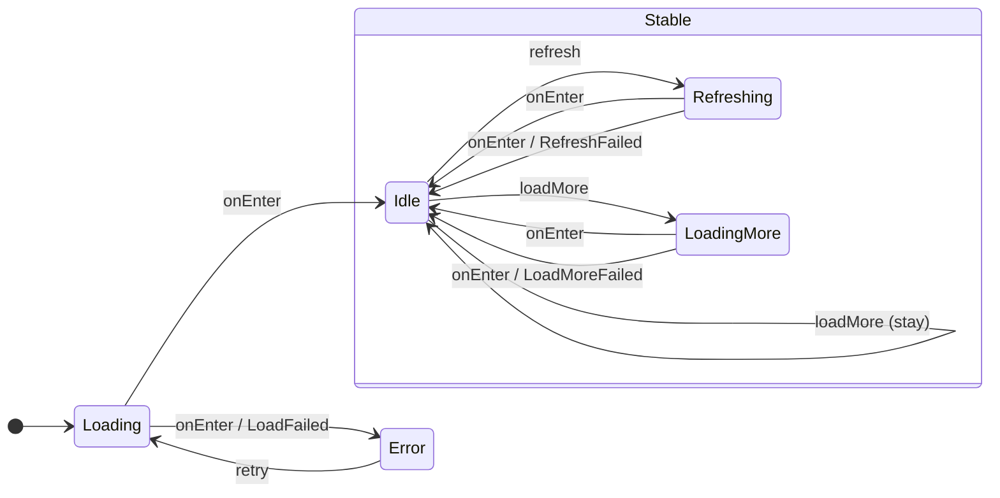
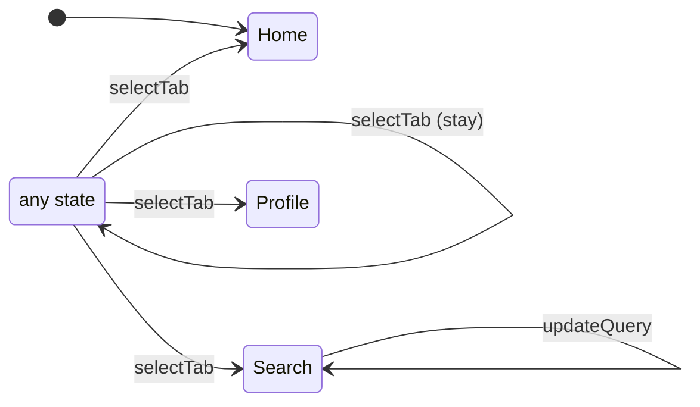
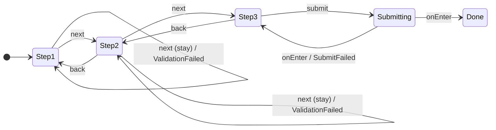
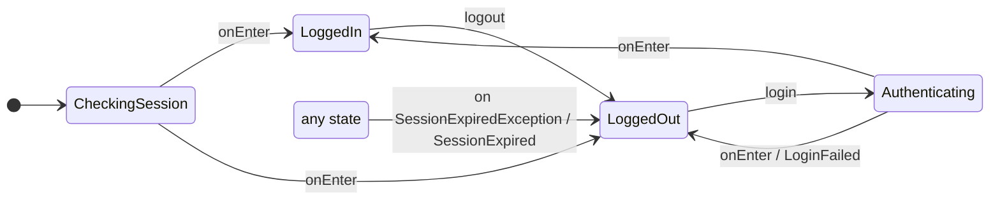

# ユースケース別サンプル集

代表的なユースケースについて「状態遷移図 / user が読み書きするコード / 生成されるコード」を並べ、
設計の手触りを確認するためのドキュメント。

- 設計の正: [generate-strict-store-factory-dsl.md](./generate-strict-store-factory-dsl.md) /
  [generate-state-diagrams.md](./generate-state-diagrams.md)
- 利用側 DSL は **named param + 両対応 param(値渡し / scope lambda)+ builder 形式(第 3 の書き方)+
  per-state configure + states() trailing escape block + plus 合成 + per-store factory**
  (2026-07-15/16/17 決定)を反映。
  生成コードは実際の snapshot golden(`koma-strict-ksp/snapshots/StoreSpecUseCasesTest/`)からの
  転記(誌面整形は下記)。宣言・利用側は写経 scenario(`Samples*UseCaseScenario.kt`)と同期している
- 前提・省略事項:
    - **入口は 2 つ**。① **koma 標準の `Store(initialState) { ... }`(生成物ではない)が正**。
      koma-strict が生成するのは builder 内で呼ぶ root の `states(...)` 拡張。receiver
      (`StoreBuilder<S, A, E>`)の型引数がどの store の states() かを選ぶため、
      `Store` の型引数は常に明示する。② **生成 per-store factory(追加の糖衣。同じ store を作る)**:
      関数名 = root 名の末尾 `State` を strip して decapitalize + `Store`(`LceState` → `lceStore`)。
      `initialState` → `states()` と同一の handler param 列 → `context: CoroutineContext? = null` →
      末尾 `configuration`(store 全体のエスケープハッチ。trailing lambda として書ける)。
      生成拡張・factory は宣言と同 package に生える
      (別 package から使う場合は import が必要。本サンプルは同 package 前提)
    - `states()` の param 型は **`{束}HandlersScope.() -> {束}Handlers`(receiver 付き関数型)で、
      値渡しと scope lambda の両対応**(param 名 = state 名 decapitalize)。
      値渡し(`loading = LceState.Loading.actions(...)`)は束クラスが「自分を返す
      `(Scope) -> Self`」(`invoke = this`)を実装しているためそのまま渡り、
      scope lambda(`loading = { actions(...) }`)は生成 HandlersScope の同シグネチャ・ミラー
      `actions()` / `states()` を呼ぶ。混在も可。値の構築経路は companion 拡張 `actions(...)`
      (leaf / default ブロック)と `states(...)`(中間 sealed)+ そのミラーのみ
      (constructor は internal)
    - **builder 形式(第 3 の書き方)**: `actions { ... }` / `states { ... }` の別 overload
      (単一 lambda)も生成され、宣言済み handler / 子 state ごとの同名 member 関数
      (+ leaf は `configure`)で登録する。**この形式に限り、網羅チェックは構築時
      (store 生成時)の fail-fast に弱まる**(不足・重複登録は actionable なメッセージ付き
      `IllegalStateException`。runtime の `BuilderFailFast.kt` がメッセージの SSoT)。
      **enter / exit は builder member を持たず、enter / exit 宣言を持つ node には
      `actions {}` overload 自体が生えない**(named-param 形式のみ。configure 内で書ける
      koma 素の enter / exit と同語で紛らわしいため)。named-param 形式(コンパイル時網羅)が
      正のまま併存する(opt-in の書き味と引き換えのトレードオフ)
    - 自分の共有宣言と子の両方を持つ中間 sealed は、親側 param 型が合成型 `{Path}Handlers` になり、
      `actions(...) + states(子のみ)` の **plus 合成**か従来形 `states(default名 = ..., 子...)`
      (合成型を直接返す overload)で埋める。片方単独では親 param に渡せない = 型エラー
      (本サンプル集に該当ケースは無い。実例と生成物は
      [generate-strict-store-factory-dsl.md](./generate-strict-store-factory-dsl.md) §利用側 DSL)
    - leaf の `actions(...)` は末尾に optional な `configure`(default `{}`)を持つ =
      **per-state エスケープハッチ**。receiver は koma の
      `koma.core.StoreBuilder.StateHandlerConfig<S, A, E, S2>`(`state<S2> {}` ブロックの
      receiver と同一型)で、生成コードが各 `state<...> {}` ブロックの末尾で呼び出す。
      trailing lambda として書ける
    - `states()`(root 拡張・中間 companion・そのミラー)も末尾に optional な escape block param
      (`configure`・default `{}`)を持つ = **per-state escape**(2026-07-17 確定)。receiver は生成
      `{Prefix}StatesConfigureScope` で、member = **宣言を持つ子 state のみ**(leaf member は
      その `state<...> {}` ブロック末尾へ、**中間 sealed member = subtree 全 leaf へ展開する
      共有 escape**。宣言ゼロ leaf は member 無し)。named の必須 param 群は不変 =
      コンパイル時網羅は無傷。同一 member の二重呼び出しは構築時 fail-fast。escape は
      GroupHandlers / 合成型が `internal val configure` として運搬し plus 合成でも引き継がれる。
      **重ね定義は koma の先勝ち**(生成 handler → leaf configure → 内側 states() escape →
      root escape の登録順)なので、**escape は宣言でカバーしない trigger 用**
      (per-store factory に per-state escape param は無い。末尾 = store-level `configuration` のまま)
    - **escape member ゼロの `states()`**(とそのミラー)と default ブロックの `actions()` の末尾には
      `PreventTrailingLambda` センチネル param(optional・非関数型)が付き、誤った
      trailing lambda はコンパイルエラーになる。leaf の `actions()`・escape member を持つ
      `states()`・per-store factory には無い
      (末尾 = configure / escape block / configuration という意図された escape に trailing lambda が
      束縛され、必須 named param の欠落は変わらずコンパイルエラー = 網羅性維持)
    - ケースごとに別 package を想定(生成型は path から root を除いた連結名のため)
    - import / `koma.core.State` 等の実装は省略。`@KomaStrictDsl` は runtime に置く
      @DslMarker アノテーション。生成 Scope には koma の `@koma.core.KomaStoreDsl` を併記する
      (handler lambda 内への koma builder API の leak 遮断)
    - 可視性は全て明示(利用モジュールが `explicitApi()` でも通る想定)。方針:
      支援型は `public`(state 宣言の可視性を継承)+ `internal constructor`(構築経路の封鎖)、
      facade だけが読む中身(Reaction の `next`・Handlers の handler / configure プロパティ)は
      `internal` = 利用者には不透明。`Impl` は **`private`**(遷移は公開 factory 経由で
      構築するため file 内で閉じる)。ただし **companion なし = factory なしの state の
      Impl のみ `internal`**(他 file の遷移が Impl を直接構築するため)
    - エラーハンドリングは簡潔さ優先で素の `runCatching` を使う
      (素の `runCatching` は `CancellationException` も捕らえるため、実運用では透過させる util を推奨)
    - `clearPendingActions()` passthrough は**全 handler Scope に生成済み**(koma への委譲。
      pending 意味論の英語 KDoc 付き — 誌面ではケース 1 の Loading にのみ記載し以後省略)
    - `@OnExit` / `@OnRecover` のコンパイルダウンは rc02 実 API 確認済み(2026-07-15)の
      確定形で実生成される
    - 誌面の生成コードは短縮名表記。実際の生成物は `@kotlin.jvm.JvmName` /
      `koma.core.StoreBuilder` / `koma.core.Store` / `kotlin.coroutines.CoroutineContext` 等の
      FQ 出力・複数 param は 1 行 1 param 整形で、
      `stayState()` / `clearPendingActions()` には pending 意味論の英語 KDoc、
      leaf の `actions()` には configure の説明 KDoc、束クラスの `invoke`(自己返し)・
      HandlersScope ミラー・per-store factory・builder overload / `{Path}ActionsBuilder`・
      `{Prefix}StatesConfigureScope`(escape block の receiver。先勝ちの合成規則を明記した契約文)にも
      説明の英語 KDoc が付く(誌面では初出のみ記載し以後省略)
- 図は描画規約に従う(英語ラベル / Mealy 記法 `action / Event` / stay は自己ループ + `(stay)` /
  共有アクションは any state 擬似ノード / `[*]` = initial)。生成物としての正式形は「図 + 遷移表」ペア

| # | ケース | 見どころ |
|---|---|---|
| 1 | 基本 LCE | 最小構成。per-store factory 入口と 3 つの書き方(値渡し / scope lambda / builder 形式)の実例、**生成コードの全量**はここに載せる |
| 2 | LCE + pull-to-refresh + additional load | 中間 sealed(`Stable`)/ 条件付き遷移(`Stay`)/ prop 持ち越し |
| 3 | タブ切替 | root 共有アクション / 宣言ゼロ state / data object 宣言 / E = Nothing |
| 4 | フォームウィザード | stay + emit(バリデーション)/ 自己遷移との違い / prop の必須・デフォルト混在 |
| 5 | 認証 + セッション切れ | `@OnRecover`(root 共有)/ `@OnExit` / 例外→宣言済み遷移の強制 |

---

## 1. 基本 LCE

### 状態遷移図



| 遷移元 | トリガ | 遷移先 | emit |
|---|---|---|---|
| Loading | enter(成功) | Content | — |
| Loading | enter(失敗) | Error | LoadFailed |
| Content | Reload | Loading | — |
| Error | Retry | Loading | — |

### 宣言(user が書く)

```kotlin
@StoreSpec(initial = [LceState.Loading::class])   // actions / events は宣言から推論
sealed interface LceState : State {
    companion object

    @OnEnter(nextState = [Content::class, Error::class], emit = [LceEvent.LoadFailed::class])
    interface Loading : LceState { companion object }

    @OnAction<LceAction.Reload>(nextState = [Loading::class])
    interface Content : LceState { val data: String; companion object }

    @OnAction<LceAction.Retry>(nextState = [Loading::class])
    interface Error : LceState { val message: String?; companion object }
}

sealed interface LceAction : Action {
    data object Reload : LceAction
    data object Retry : LceAction
}

sealed interface LceEvent : Event {
    data class LoadFailed(val message: String?) : LceEvent
}
```

### 利用側(user が書く)

```kotlin
// 主: 生成 per-store factory 経由(型引数を書かない糖衣入口。命名 = root 名の末尾 State を strip + Store)
val store = lceStore(
    initialState = LceState.Loading(),
    loading = LceState.Loading.actions(
        enter = {
            runCatching { fetchData() }.fold(
                onSuccess = { nextState.toContent(data = it) },
                onFailure = {
                    emitLoadFailed(it.message)
                    nextState.toError(message = it.message)
                },
            )
        },
    ),
    content = LceState.Content.actions(reload = { nextState.toLoading() }) {
        // actions() の末尾 trailing lambda = configure(per-state エスケープハッチ)。
        // 生成される state<LceState.Content> {} ブロックの末尾に素の koma DSL として差し込まれる
        exit { log("content left") }
    },
    error = LceState.Error.actions(retry = { nextState.toLoading() }),
) {
    // 末尾 configuration = store 全体のエスケープハッチ(生成 handler 登録の後に素の koma DSL を追記)
    state<LceState.Error> { exit { log("error left") } }
}

// koma 標準の Store {} + states() 拡張(正)も従来どおり使える。param は両対応 —
// 旧 scope lambda 形式({ actions(...) })と値渡し(LceState.Content.actions(...))を混在できる
fun buildLceStoreWithKomaEntry(): Store<LceState, LceAction, LceEvent> =
    Store<LceState, LceAction, LceEvent>(initialState = LceState.Loading()) {   // 型引数は常に明示
        states(
            loading = { actions(enter = { nextState.toContent(data = fetchData()) }) },   // scope lambda 形式
            content = LceState.Content.actions(reload = { nextState.toLoading() }),       // 値渡し
            error = { actions(retry = { nextState.toLoading() }) },
        )
    }

// builder 形式(第 3 の書き方)。宣言済み handler ごとの member 関数で登録する。
// この形式に限り網羅チェックは構築時 fail-fast(不足・重複登録は実行時エラー)。
// enter 宣言を持つ Loading には actions {} overload 自体が生えない(named-param 形式のみ)
fun buildLceStoreWithBuilderForm(): Store<LceState, LceAction, LceEvent> =
    Store<LceState, LceAction, LceEvent>(initialState = LceState.Loading()) {
        states(
            loading = LceState.Loading.actions(enter = { nextState.toContent(data = fetchData()) }),
            content = LceState.Content.actions {
                reload { nextState.toLoading() }
                configure { exit { log("content left") } }   // builder 内でも per-state escape hatch を書ける
            },
            error = { actions { retry { nextState.toLoading() } } },   // scope ミラー側の builder overload
        )
    }
```

### 生成されるコード(全量)

```kotlin
// ---- LceState.Loading.generated.kt ----
// 実体は private: 利用者も他の生成ファイルも公開 factory `LceState.Loading()` 経由で構築する
private data object LoadingImpl : LceState.Loading

public operator fun LceState.Loading.Companion.invoke(): LceState.Loading = LoadingImpl

public sealed interface LoadingEnterReaction {
    public class Transition internal constructor(
        internal val next: LceState,   // facade だけが読む = 利用者には不透明
    ) : LoadingEnterReaction
    // Stay 未宣言のため Stay は存在しない = 必ず遷移する
}

public class LoadingEnterTransitions internal constructor(
    @Suppress("unused") private val state: LceState.Loading,
) {
    public fun toContent(data: String): LoadingEnterReaction =
        LoadingEnterReaction.Transition(LceState.Content(data))

    public fun toError(message: String?): LoadingEnterReaction =
        LoadingEnterReaction.Transition(LceState.Error(message))
}

// Scope には @KomaStrictDsl と koma の @KomaStoreDsl を併記(koma builder API の leak 遮断)
@KomaStrictDsl
@koma.core.KomaStoreDsl
public class LoadingEnterScope internal constructor(
    public val state: LceState.Loading,
    private val eventSink: suspend (LceEvent) -> Unit,   // koma の event() は suspend
    private val onClearPendingActions: () -> Unit,       // koma の clearPendingActions への passthrough
) {
    public val nextState: LoadingEnterTransitions = LoadingEnterTransitions(state)

    public suspend fun emitLoadFailed(message: String?) {
        eventSink(LceEvent.LoadFailed(message))
    }

    /**
     * Cancels queued actions that have not started executing yet (passthrough to koma's
     * clearPendingActions).
     *
     * Note: koma's default pending-action policy discards queued actions only when a
     * transition to a *different* state class is committed. Staying (stayState) and
     * self-transitions keep them — call this to drop them explicitly.
     */
    public fun clearPendingActions() {
        onClearPendingActions()
    }
}

// 束クラスは「自分を返す (Scope) -> Self」を実装 = 値渡し / scope lambda 両対応の仕掛け
public class LoadingHandlers internal constructor(
    internal val enter: suspend LoadingEnterScope.() -> LoadingEnterReaction,   // facade だけが読む
    internal val configure: StoreBuilder.StateHandlerConfig<LceState, LceAction, LceEvent, LceState.Loading>.() -> Unit,
) : (LoadingHandlersScope) -> LoadingHandlers {
    /**
     * Returns this bundle itself. Implementing `(LoadingHandlersScope) -> LoadingHandlers` lets an
     * already-built value be passed as-is to the scope-lambda-typed `states(...)` parameter,
     * keeping the value-passing form and the scope-lambda form interchangeable.
     */
    override fun invoke(p1: LoadingHandlersScope): LoadingHandlers = this
}

// Handlers の構築経路その 1(値渡し用の companion 拡張)。末尾の optional configure = per-state エスケープハッチ
/** Bundles this state's handlers. [configure] appends raw koma DSL at the end of the generated `state<...> {}` block (per-state escape hatch). */
public fun LceState.Loading.Companion.actions(
    enter: suspend LoadingEnterScope.() -> LoadingEnterReaction,
    configure: StoreBuilder.StateHandlerConfig<LceState, LceAction, LceEvent, LceState.Loading>.() -> Unit = {},
): LoadingHandlers = LoadingHandlers(enter, configure)

// 構築経路その 2(scope lambda 形式の receiver)。actions() は companion 拡張と同シグネチャのミラー
/** Receiver of the scope-lambda form (`{ actions(...) }`) of the matching `states(...)` parameter. [actions] mirrors the companion `actions(...)` extension. */
@KomaStrictDsl
@koma.core.KomaStoreDsl
public class LoadingHandlersScope internal constructor() {
    public fun actions(   // KDoc は companion 拡張と同文(誌面では以後省略)
        enter: suspend LoadingEnterScope.() -> LoadingEnterReaction,
        configure: StoreBuilder.StateHandlerConfig<LceState, LceAction, LceEvent, LceState.Loading>.() -> Unit = {},
    ): LoadingHandlers = LoadingHandlers(enter, configure)
}

// enter 宣言を持つ Loading には builder 形式(構築経路その 3)の actions {} overload と
// ActionsBuilder を生成しない(enter / exit は builder member を持たないため網羅を満たせない。
// named-param 形式のみ — Content / Error との差分に注目)

// ---- LceState.Content.generated.kt ----
private data class ContentImpl(override val data: String) : LceState.Content

public operator fun LceState.Content.Companion.invoke(data: String): LceState.Content = ContentImpl(data)

public sealed interface ContentReloadReaction {
    public class Transition internal constructor(internal val next: LceState) : ContentReloadReaction
}

public class ContentReloadTransitions internal constructor(
    @Suppress("unused") private val state: LceState.Content,
) {
    public fun toLoading(): ContentReloadReaction = ContentReloadReaction.Transition(LceState.Loading())
}

@KomaStrictDsl
@koma.core.KomaStoreDsl
public class ContentReloadScope internal constructor(
    public val state: LceState.Content,
    public val action: LceAction.Reload,
    private val onClearPendingActions: () -> Unit,
) {
    // emit 宣言なし → emitXxx が生えず、eventSink 自体も持たない
    public val nextState: ContentReloadTransitions = ContentReloadTransitions(state)

    public fun clearPendingActions() {   // KDoc は Loading と同文(誌面では以後省略)
        onClearPendingActions()
    }
}

public class ContentHandlers internal constructor(
    internal val reload: suspend ContentReloadScope.() -> ContentReloadReaction,
    internal val configure: StoreBuilder.StateHandlerConfig<LceState, LceAction, LceEvent, LceState.Content>.() -> Unit,
) : (ContentHandlersScope) -> ContentHandlers {
    override fun invoke(p1: ContentHandlersScope): ContentHandlers = this   // KDoc は Loading と同文(誌面では以後省略)
}

public fun LceState.Content.Companion.actions(   // KDoc は Loading と同文(誌面では以後省略)
    reload: suspend ContentReloadScope.() -> ContentReloadReaction,
    configure: StoreBuilder.StateHandlerConfig<LceState, LceAction, LceEvent, LceState.Content>.() -> Unit = {},
): ContentHandlers = ContentHandlers(reload, configure)

// 構築経路その 3(builder 形式の overload)。enter / exit 宣言の無い node にだけ生える
/**
 * Builder-form overload of `actions(...)` (see [ContentActionsBuilder]).
 *
 * Note: unlike the named-argument overload, exhaustiveness of the declared handlers is
 * checked **at build time** (fail-fast when the block finishes), not at compile time.
 * This overload exists only for states without enter / exit declarations (those handlers
 * have no builder member).
 */
public fun LceState.Content.Companion.actions(build: ContentActionsBuilder.() -> Unit): ContentHandlers = ContentActionsBuilder().apply(build).build()

@KomaStrictDsl
@koma.core.KomaStoreDsl
public class ContentHandlersScope internal constructor() {   // KDoc は Loading と同文(誌面では以後省略)
    public fun actions(
        reload: suspend ContentReloadScope.() -> ContentReloadReaction,
        configure: StoreBuilder.StateHandlerConfig<LceState, LceAction, LceEvent, LceState.Content>.() -> Unit = {},
    ): ContentHandlers = ContentHandlers(reload, configure)

    // ミラーにも builder overload が同居する(KDoc は companion 拡張側と同文・誌面では以後省略)
    public fun actions(build: ContentActionsBuilder.() -> Unit): ContentHandlers = ContentActionsBuilder().apply(build).build()
}

// builder 形式の receiver。member 名 = named param 名(action 名 / configure)。
// throwDuplicateBuilderEntry / throwMissingBuilderEntries は runtime の BuilderFailFast.kt(メッセージ SSoT)
/**
 * Builder receiver of the `actions { ... }` overload building [ContentHandlers].
 *
 * Each member function registers the handler of the same-named `actions(...)` parameter.
 * Exhaustiveness is checked when the block finishes (build-time fail-fast), not at compile
 * time: handlers left unregistered — and any duplicate registration — throw
 * [IllegalStateException]. Prefer the named-argument `actions(...)` overload to catch
 * missing handlers at compile time.
 */
@KomaStrictDsl
@koma.core.KomaStoreDsl
public class ContentActionsBuilder internal constructor() {
    private var reload: (suspend ContentReloadScope.() -> ContentReloadReaction)? = null

    private var configure: (StoreBuilder.StateHandlerConfig<LceState, LceAction, LceEvent, LceState.Content>.() -> Unit)? = null

    /** Registers the handler of the same-named `actions(...)` parameter. Duplicate registration fails fast with [IllegalStateException]. */
    public fun reload(handler: suspend ContentReloadScope.() -> ContentReloadReaction) {
        if (this.reload != null) throwDuplicateBuilderEntry("LceState.Content", "reload")
        this.reload = handler
    }

    /** Appends raw koma DSL at the end of the generated `state<...> {}` block (the trailing `configure` parameter of `actions(...)`). Duplicate registration fails fast with [IllegalStateException]. */
    public fun configure(block: StoreBuilder.StateHandlerConfig<LceState, LceAction, LceEvent, LceState.Content>.() -> Unit) {
        if (this.configure != null) throwDuplicateBuilderEntry("LceState.Content", "configure")
        this.configure = block
    }

    internal fun build(): ContentHandlers {
        val missing = listOfNotNull(
            "reload".takeIf { reload == null },
        )
        if (missing.isNotEmpty()) throwMissingBuilderEntries("LceState.Content", missing)
        return ContentHandlers(reload!!, configure ?: {})
    }
}

// ---- LceState.Error.generated.kt ----(Content と相似形のため Impl/factory を省略)
public sealed interface ErrorRetryReaction {
    public class Transition internal constructor(internal val next: LceState) : ErrorRetryReaction
}

public class ErrorRetryTransitions internal constructor(
    @Suppress("unused") private val state: LceState.Error,
) {
    public fun toLoading(): ErrorRetryReaction = ErrorRetryReaction.Transition(LceState.Loading())
}

@KomaStrictDsl
@koma.core.KomaStoreDsl
public class ErrorRetryScope internal constructor(
    public val state: LceState.Error,
    public val action: LceAction.Retry,
    private val onClearPendingActions: () -> Unit,
) {
    public val nextState: ErrorRetryTransitions = ErrorRetryTransitions(state)

    public fun clearPendingActions() {
        onClearPendingActions()
    }
}

public class ErrorHandlers internal constructor(
    internal val retry: suspend ErrorRetryScope.() -> ErrorRetryReaction,
    internal val configure: StoreBuilder.StateHandlerConfig<LceState, LceAction, LceEvent, LceState.Error>.() -> Unit,
) : (ErrorHandlersScope) -> ErrorHandlers {
    override fun invoke(p1: ErrorHandlersScope): ErrorHandlers = this
}

public fun LceState.Error.Companion.actions(
    retry: suspend ErrorRetryScope.() -> ErrorRetryReaction,
    configure: StoreBuilder.StateHandlerConfig<LceState, LceAction, LceEvent, LceState.Error>.() -> Unit = {},
): ErrorHandlers = ErrorHandlers(retry, configure)

// builder overload / ActionsBuilder は Content と相似形(KDoc 誌面省略)
public fun LceState.Error.Companion.actions(build: ErrorActionsBuilder.() -> Unit): ErrorHandlers = ErrorActionsBuilder().apply(build).build()

@KomaStrictDsl
@koma.core.KomaStoreDsl
public class ErrorHandlersScope internal constructor() {
    public fun actions(
        retry: suspend ErrorRetryScope.() -> ErrorRetryReaction,
        configure: StoreBuilder.StateHandlerConfig<LceState, LceAction, LceEvent, LceState.Error>.() -> Unit = {},
    ): ErrorHandlers = ErrorHandlers(retry, configure)

    public fun actions(build: ErrorActionsBuilder.() -> Unit): ErrorHandlers = ErrorActionsBuilder().apply(build).build()
}

@KomaStrictDsl
@koma.core.KomaStoreDsl
public class ErrorActionsBuilder internal constructor() {
    private var retry: (suspend ErrorRetryScope.() -> ErrorRetryReaction)? = null

    private var configure: (StoreBuilder.StateHandlerConfig<LceState, LceAction, LceEvent, LceState.Error>.() -> Unit)? = null

    public fun retry(handler: suspend ErrorRetryScope.() -> ErrorRetryReaction) {
        if (this.retry != null) throwDuplicateBuilderEntry("LceState.Error", "retry")
        this.retry = handler
    }

    public fun configure(block: StoreBuilder.StateHandlerConfig<LceState, LceAction, LceEvent, LceState.Error>.() -> Unit) {
        if (this.configure != null) throwDuplicateBuilderEntry("LceState.Error", "configure")
        this.configure = block
    }

    internal fun build(): ErrorHandlers {
        val missing = listOfNotNull(
            "retry".takeIf { retry == null },
        )
        if (missing.isNotEmpty()) throwMissingBuilderEntries("LceState.Error", missing)
        return ErrorHandlers(retry!!, configure ?: {})
    }
}

// ---- LceState.storeSpec.generated.kt ----(唯一の全体依存ファイル)
// koma 標準の Store {} 内で呼ぶ root states() 拡張。
// receiver の型引数(StoreBuilder<LceState, LceAction, LceEvent>)が「どの store の states() か」を選ぶ。
// param 型 = {束}HandlersScope.() -> {束}Handlers(値渡しと scope lambda の両対応)
@JvmName("lceStateStates")   // 他 store の states() との JVM signature clash 回避(一律付与)
@Suppress("NAME_SHADOWING")
public fun StoreBuilder<LceState, LceAction, LceEvent>.states(
    loading: LoadingHandlersScope.() -> LoadingHandlers,
    content: ContentHandlersScope.() -> ContentHandlers,
    error: ErrorHandlersScope.() -> ErrorHandlers,
    configure: LceStateStatesConfigureScope.() -> Unit = {},   // 末尾 = trailing escape block(per-state escape。センチネルは member ゼロの states() のみに残る)
) {
    // scope lambda を評価して Handlers 値へ解決(値渡しは Function1 実装が自分を返すだけ)
    val loading = LoadingHandlersScope().loading()
    val content = ContentHandlersScope().content()
    val error = ErrorHandlersScope().error()
    val configure = LceStateStatesConfigureScope().apply(configure)   // escape block を評価して member 登録を確定

    state<LceState.Loading> {
        enter {
            when (val r = loading.enter(LoadingEnterScope(state, ::event, ::clearPendingActions))) {
                is LoadingEnterReaction.Transition -> nextState { r.next }
            }
        }
        loading.configure(this)           // leaf actions() の per-state エスケープハッチ
        configure.loading?.invoke(this)   // states() escape の同名 member(leaf configure の後 = 登録順の最後。先勝ちなので前が勝つ)
    }
    state<LceState.Content> {
        action<LceAction.Reload> {
            when (val r = content.reload(ContentReloadScope(state, action, ::clearPendingActions))) {   // emit なし Scope は eventSink を受けない
                is ContentReloadReaction.Transition -> nextState { r.next }
            }
        }
        content.configure(this)
        configure.content?.invoke(this)
    }
    state<LceState.Error> {
        action<LceAction.Retry> {
            when (val r = error.retry(ErrorRetryScope(state, action, ::clearPendingActions))) {
                is ErrorRetryReaction.Transition -> nextState { r.next }
            }
        }
        error.configure(this)
        configure.error?.invoke(this)
    }
}

// per-store factory: koma Store() + states() を包む糖衣(koma 直入口は正のまま併存)
/**
 * Builds a [Store] for [LceState] without spelling the store type arguments.
 *
 * Sugar over the canonical koma entry point — `Store<LceState, LceAction, LceEvent>(initialState) { states(...) }`
 * builds the exact same store. [configuration] appends raw koma DSL after the generated
 * handlers (store-level escape hatch).
 */
public fun lceStore(
    initialState: LceState,
    loading: LoadingHandlersScope.() -> LoadingHandlers,   // states() と同一の handler param 列
    content: ContentHandlersScope.() -> ContentHandlers,
    error: ErrorHandlersScope.() -> ErrorHandlers,
    context: CoroutineContext? = null,                     // koma Store へ passthrough
    configuration: StoreBuilder<LceState, LceAction, LceEvent>.() -> Unit = {},   // 末尾 = 意図された trailing lambda(センチネル不要)
): Store<LceState, LceAction, LceEvent> =
    Store<LceState, LceAction, LceEvent>(initialState = initialState, context = context) {
        states(
            loading = loading,
            content = content,
            error = error,
        )
        configuration()
    }

// states() の trailing escape block の receiver。member = 宣言を持つ子 state 名。
// KDoc は重ね定義の合成規則(先勝ち)を利用者へ伝える契約文(初出のみ全文記載)
/**
 * Receiver of the trailing `configure` block of the matching `states(...)` call — the
 * per-state escape hatch. Each member appends raw koma DSL to the generated `state<...> {}`
 * block(s) of the same-named child state, after the generated registrations (and after the
 * leaf's own `actions(configure = ...)` block). Calling the same member twice fails fast
 * with [IllegalStateException].
 *
 * Overlapping registrations (measured against koma-core rc02): koma dispatches at most one
 * handler per trigger — when multiple registered handlers match the same state and trigger,
 * the **first registered** one runs and later ones are silently ignored. Generated
 * registrations always precede this escape block, so a raw handler for a trigger already
 * declared on the state never runs; use this escape for what the declarations do not cover
 * (raw `enter` / `exit` / `action<A>` / `recover<T>` of undeclared triggers, `launch`,
 * dispatcher overrides, ...).
 */
@KomaStrictDsl
@koma.core.KomaStoreDsl
public class LceStateStatesConfigureScope internal constructor() {
    internal var loading: (StoreBuilder.StateHandlerConfig<LceState, LceAction, LceEvent, LceState.Loading>.() -> Unit)? = null

    internal var content: (StoreBuilder.StateHandlerConfig<LceState, LceAction, LceEvent, LceState.Content>.() -> Unit)? = null

    internal var error: (StoreBuilder.StateHandlerConfig<LceState, LceAction, LceEvent, LceState.Error>.() -> Unit)? = null

    /** Appends raw koma DSL at the end of the generated `state<LceState.Loading> {}` block. Fails fast if called twice. */
    public fun loading(block: StoreBuilder.StateHandlerConfig<LceState, LceAction, LceEvent, LceState.Loading>.() -> Unit) {
        if (this.loading != null) throwDuplicateBuilderEntry("LceState", "loading")   // fail-fast は runtime の BuilderFailFast.kt(メッセージ SSoT)
        this.loading = block
    }

    public fun content(block: StoreBuilder.StateHandlerConfig<LceState, LceAction, LceEvent, LceState.Content>.() -> Unit) {   // KDoc は loading と同型(誌面では以後省略)
        if (this.content != null) throwDuplicateBuilderEntry("LceState", "content")
        this.content = block
    }

    public fun error(block: StoreBuilder.StateHandlerConfig<LceState, LceAction, LceEvent, LceState.Error>.() -> Unit) {
        if (this.error != null) throwDuplicateBuilderEntry("LceState", "error")
        this.error = block
    }
}
```

---

## 2. LCE + pull-to-refresh + additional load

refresh 中・追加ロード中も一覧(`items`)を出し続けるため、`Stable` 中間 sealed に
`Idle` / `Refreshing` / `LoadingMore` を置く。additional load は `hasMore` による**条件付き遷移**。

### 状態遷移図



| 遷移元 | トリガ | 遷移先 | emit |
|---|---|---|---|
| Loading | enter(成功 / 失敗) | Stable.Idle / Error | — / LoadFailed |
| Stable.Idle | Refresh | Stable.Refreshing | — |
| Stable.Idle | LoadMore(hasMore) | Stable.LoadingMore | — |
| Stable.Idle | LoadMore(!hasMore) | stay | — |
| Stable.Refreshing | enter(成功 / 失敗) | Stable.Idle(items 差し替え / 温存) | — / RefreshFailed |
| Stable.LoadingMore | enter(成功 / 失敗) | Stable.Idle(items 追記 / 温存) | — / LoadMoreFailed |
| Error | Retry | Loading | — |

### 宣言(user が書く)

```kotlin
@StoreSpec(initial = [FeedState.Loading::class])
sealed interface FeedState : State {
    companion object

    @OnEnter(nextState = [Stable.Idle::class, Error::class], emit = [FeedEvent.LoadFailed::class])
    interface Loading : FeedState { companion object }

    sealed interface Stable : FeedState {          // 共有 prop は 1 回だけ宣言
        val items: List<String>
        companion object

        @OnAction<FeedAction.Refresh>(nextState = [Refreshing::class])
        @OnAction<FeedAction.LoadMore>(nextState = [Stay::class, LoadingMore::class]) // 条件付き遷移
        interface Idle : Stable { val hasMore: Boolean; companion object }

        @OnEnter(nextState = [Idle::class], emit = [FeedEvent.RefreshFailed::class])
        interface Refreshing : Stable { companion object }

        @OnEnter(nextState = [Idle::class], emit = [FeedEvent.LoadMoreFailed::class])
        interface LoadingMore : Stable { companion object }
    }

    @OnAction<FeedAction.Retry>(nextState = [Loading::class])
    interface Error : FeedState { val message: String?; companion object }
}

sealed interface FeedAction : Action {
    data object Refresh : FeedAction
    data object LoadMore : FeedAction
    data object Retry : FeedAction
}

sealed interface FeedEvent : Event {
    data class LoadFailed(val message: String?) : FeedEvent
    data class RefreshFailed(val message: String?) : FeedEvent
    data class LoadMoreFailed(val message: String?) : FeedEvent
}
```

### 利用側(user が書く)

```kotlin
val store = Store<FeedState, FeedAction, FeedEvent>(initialState = FeedState.Loading()) {
    states(
        loading = FeedState.Loading.actions(
            enter = {
                runCatching { fetchPage(offset = 0) }.fold(
                    onSuccess = { nextState.toStableIdle(items = it.items, hasMore = it.hasMore) },
                    onFailure = {
                        emitLoadFailed(it.message)
                        nextState.toError(message = it.message)
                    },
                )
            },
        ),
        stable = FeedState.Stable.states(
            idle = FeedState.Stable.Idle.actions(
                refresh = { nextState.toRefreshing() },   // items は同名 prop から持ち越し
                loadMore = { if (state.hasMore) nextState.toLoadingMore() else stayState() },
            ),
            refreshing = FeedState.Stable.Refreshing.actions(
                enter = {
                    runCatching { fetchPage(offset = 0) }.fold(
                        onSuccess = { nextState.toIdle(items = it.items, hasMore = it.hasMore) },
                        onFailure = {
                            emitRefreshFailed(it.message)
                            nextState.toIdle(hasMore = true)   // items は持ち越し = 旧一覧を温存
                        },
                    )
                },
            ),
            loadingMore = FeedState.Stable.LoadingMore.actions(
                enter = {
                    runCatching { fetchPage(offset = state.items.size) }.fold(
                        onSuccess = { nextState.toIdle(items = state.items + it.items, hasMore = it.hasMore) },
                        onFailure = {
                            emitLoadMoreFailed(it.message)
                            nextState.toIdle(hasMore = true)
                        },
                    )
                },
            ),
        ),
        error = FeedState.Error.actions(retry = { nextState.toLoading() }),
    ) {
        // states() の trailing block = per-state escape(素の koma DSL を state 単位で差し込む)。
        // 同一 trigger は先勝ち(生成 handler が常に先)なので、宣言でカバーしない trigger 用
        loading {
            // Loading では Retry を宣言していない → 素の handler が発火できる(escape の実例)
            action<FeedAction.Retry> { }
        }
        stable {
            // 中間 sealed member = subtree の全 leaf の state ブロックへ展開される共有 escape
        }
        error {
        }
    }
}
```

### 生成コードの見どころ(抜粋)

```kotlin
// Stay 宣言由来の Reaction(Idle の LoadMore)
public sealed interface StableIdleLoadMoreReaction {
    public class Transition internal constructor(internal val next: FeedState) : StableIdleLoadMoreReaction
    public data object Stay : StableIdleLoadMoreReaction     // nextState = [Stay::class, ...] 宣言由来
}

// 同名 prop 持ち越し(cream property matching): items にデフォルト値が付く
public class StableIdleLoadMoreTransitions internal constructor(
    private val state: FeedState.Stable.Idle,
) {
    public fun toLoadingMore(
        items: List<String> = state.items,
    ): StableIdleLoadMoreReaction =
        StableIdleLoadMoreReaction.Transition(FeedState.Stable.LoadingMore(items))
}

// 中間 sealed の束ね: param は両対応(scope lambda 型)で、companion 拡張 states() と
// StableGroupHandlersScope のミラー states() が GroupHandlers の構築経路
// (builder 形式の states {}(StableGroupBuilder。member = 子 state 名で値渡し / nested builder の
// 2 overload)も第 3 の構築経路として生える — 誌面省略)。
// Stable は自宣言なし → GroupHandlers がそのまま親側 param 型(actions() が生えないので plus 合成も無い。
// 自宣言つき中間の plus 合成は generate-strict-store-factory-dsl.md §利用側 DSL を参照)。
// 末尾は trailing escape block(configure)。escape は internal val configure として運搬し、
// root states() が leaf の state ブロックへ適用する(plus 合成でも引き継がれる)
public class StableGroupHandlers internal constructor(
    internal val idle: StableIdleHandlers,           // 中身は facade だけが読む
    internal val refreshing: StableRefreshingHandlers,
    internal val loadingMore: StableLoadingMoreHandlers,
    internal val configure: StableStatesConfigureScope,   // escape block の運搬
) : (StableGroupHandlersScope) -> StableGroupHandlers {
    override fun invoke(p1: StableGroupHandlersScope): StableGroupHandlers = this   // 値渡し用の自己返し(KDoc 誌面省略)
}

public fun FeedState.Stable.Companion.states(
    idle: StableIdleHandlersScope.() -> StableIdleHandlers,
    refreshing: StableRefreshingHandlersScope.() -> StableRefreshingHandlers,
    loadingMore: StableLoadingMoreHandlersScope.() -> StableLoadingMoreHandlers,
    configure: StableStatesConfigureScope.() -> Unit = {},   // trailing escape block(member = 宣言を持つ子 state 名)
): StableGroupHandlers =
    StableGroupHandlers(
        StableIdleHandlersScope().idle(),
        StableRefreshingHandlersScope().refreshing(),
        StableLoadingMoreHandlersScope().loadingMore(),
        StableStatesConfigureScope().apply(configure),
    )

// StableStatesConfigureScope(escape scope。相似形はケース 1 の LceStateStatesConfigureScope)は
// member = idle / refreshing / loadingMore。root の FeedStateStatesConfigureScope は
// member = loading / stable / error で、stable(中間 sealed member)だけ KDoc・展開先が異なる:
// 「subtree 全 leaf へ展開する共有 escape」(共有アクション展開と同型)— 誌面省略

// root states() 拡張のコンパイルダウン(state<FeedState.Stable.Idle> ブロック・抜粋)。
// 適用順 = 生成 handler → leaf configure → 内側 states() escape → root escape。
// koma は同一 trigger を先勝ちで dispatch するため、前に登録されたものが必ず勝つ
// state<FeedState.Stable.Idle> {
//     action<FeedAction.Refresh> { /* 生成 handler */ }
//     action<FeedAction.LoadMore> { /* 生成 handler */ }
//     stable.idle.configure(this)           // leaf actions() の configure
//     stable.configure.idle?.invoke(this)   // 中間 states() escape の leaf member
//     configure.stable?.invoke(this as StoreBuilder.StateHandlerConfig<FeedState, FeedAction, FeedEvent, FeedState.Stable>)
//                                           // root escape の中間 sealed member = 共有 escape(supertype receiver へ cast 適用)
// }
```

---

## 3. タブ切替

全 state 横断の**root 共有アクション**でタブを切り替える。タブ state は `data object` 宣言
(従来通り可)と「宣言ゼロ + companion なし」の実例。event 宣言ゼロなので E = Nothing。

### 状態遷移図



| 遷移元 | トリガ | 遷移先 | emit |
|---|---|---|---|
| any state | SelectTab(該当タブ) | Home / Search / Profile | — |
| any state | SelectTab(現在タブ) | stay | — |
| Search | UpdateQuery | Search(自己遷移) | — |

### 宣言(user が書く)

```kotlin
@StoreSpec(initial = [TabsState.Home::class])
@OnAction<TabsAction.SelectTab>(   // root 共有アクション = default ブロック
    // root 自身の annotation からは入れ子 state を bare 名で解決できないため qualify が必要
    nextState = [Stay::class, TabsState.Home::class, TabsState.Search::class, TabsState.Profile::class],
)
sealed interface TabsState : State {
    data object Home : TabsState                       // data object 宣言(従来通り可)

    @OnAction<TabsAction.UpdateQuery>(nextState = [Search::class])   // 自己遷移
    interface Search : TabsState { val query: String; companion object }

    data object Profile : TabsState                    // 宣言ゼロ → facade に引数が生えない

    // companion object の直後に修飾子付き宣言(data object 等)を置くと kotlinc の
    // parser quirk で companion が壊れる(koma-strict が警告診断を出す)ため末尾に置く
    companion object
}

sealed interface TabsAction : Action {
    data class SelectTab(val tab: Tab) : TabsAction {
        enum class Tab { Home, Search, Profile }
    }
    data class UpdateQuery(val query: String) : TabsAction
}
// event なし → E = Nothing として生成
```

### 利用側(user が書く)

```kotlin
val store = Store<TabsState, TabsAction, Nothing>(initialState = TabsState.Home) {
    states(
        default = TabsState.actions(
            selectTab = {
                when (action.tab) {
                    Tab.Home -> if (state is TabsState.Home) stayState() else nextState.toHome()
                    Tab.Search -> if (state is TabsState.Search) stayState() else nextState.toSearch(query = "")
                    Tab.Profile -> if (state is TabsState.Profile) stayState() else nextState.toProfile()
                }
            },
        ),
        search = TabsState.Search.actions(
            updateQuery = { nextState.toSearch(query = action.query) },   // 入力の取り込みは明示(原則 2)
        ),
    )
}
```

### 生成コードの見どころ(抜粋)

```kotlin
// root 共有アクションの scope は root 型(state: TabsState)。
// event 宣言ゼロ(E = Nothing)→ emitXxx が生えず、eventSink 自体も持たない
@KomaStrictDsl
@koma.core.KomaStoreDsl
public class TabsStateSelectTabScope internal constructor(
    public val state: TabsState,
    public val action: TabsAction.SelectTab,
    private val onClearPendingActions: () -> Unit,
) {
    public val nextState: TabsStateSelectTabTransitions = TabsStateSelectTabTransitions(state)
    public fun stayState(): TabsStateSelectTabReaction = TabsStateSelectTabReaction.Stay
    // clearPendingActions() は全 Scope 共通(誌面省略)
}

// default ブロックの actions(): 単一の koma ブロックに対応しないため configure は無く、
// 末尾はセンチネル(誤 trailing lambda 防止)
public fun TabsState.Companion.actions(
    selectTab: suspend TabsStateSelectTabScope.() -> TabsStateSelectTabReaction,
    preventTrailingLambda: PreventTrailingLambda = PreventTrailingLambda,
): TabsStateDefaultHandlers = TabsStateDefaultHandlers(selectTab)

// root states() 拡張: default が先頭、宣言ゼロの Home / Profile は引数なし。
// E = Nothing でも receiver の型引数がそのまま store を選ぶ。param は両対応の scope lambda 型
// (integrationTest の TabsStore は scope lambda 形式 `default = { actions(...) }` で書いた実例)。
// escape block(TabsStateStatesConfigureScope)の member も search のみ =
// 宣言を持つ子 state だけ(宣言ゼロの Home / Profile と default には member が生えない)
@JvmName("tabsStateStates")
public fun StoreBuilder<TabsState, TabsAction, Nothing>.states(
    default: TabsStateDefaultHandlersScope.() -> TabsStateDefaultHandlers,
    search: SearchHandlersScope.() -> SearchHandlers,
    configure: TabsStateStatesConfigureScope.() -> Unit = {},
) {
    // 本体は LCE の states() と同型。root 共有アクションを全 leaf の state ブロックへ展開する
}
```

---

## 4. フォームウィザード

直線的な step 遷移 + back。バリデーション失敗は **stay + emit**(state は変えずに
event で通知)。`InputName` の**自己遷移**(state を作り直す)との違いが出る。

### 状態遷移図



| 遷移元 | トリガ | 遷移先 | emit |
|---|---|---|---|
| Step1 | InputName | Step1(自己遷移) | — |
| Step1 / Step2 | Next(検証 NG) | stay | ValidationFailed |
| Step1 → Step2 → Step3 | Next(検証 OK) | 次 step | — |
| Step2 / Step3 | Back | 前 step | — |
| Step3 | Submit | Submitting | — |
| Submitting | enter(成功 / 失敗) | Done / Step3 | — / SubmitFailed |

### 宣言(user が書く)

```kotlin
@StoreSpec(initial = [WizardState.Step1::class])
sealed interface WizardState : State {
    companion object

    @OnAction<WizardAction.InputName>(nextState = [Step1::class])  // 自己遷移
    @OnAction<WizardAction.Next>(
        nextState = [Stay::class, Step2::class],                   // 検証 NG は stay
        emit = [WizardEvent.ValidationFailed::class],
    )
    interface Step1 : WizardState { val name: String; companion object }

    @OnAction<WizardAction.Next>(
        nextState = [Stay::class, Step3::class],
        emit = [WizardEvent.ValidationFailed::class],
    )
    @OnAction<WizardAction.Back>(nextState = [Step1::class])
    interface Step2 : WizardState { val name: String; val email: String; companion object }

    @OnAction<WizardAction.Submit>(nextState = [Submitting::class])
    @OnAction<WizardAction.Back>(nextState = [Step2::class])
    interface Step3 : WizardState { val name: String; val email: String; companion object }

    @OnEnter(nextState = [Done::class, Step3::class], emit = [WizardEvent.SubmitFailed::class])
    interface Submitting : WizardState { val name: String; val email: String; companion object }

    interface Done : WizardState   // 宣言ゼロ + companion なし → 引数も factory も生えない
}

sealed interface WizardAction : Action {
    data class InputName(val name: String) : WizardAction
    data object Next : WizardAction
    data object Back : WizardAction
    data object Submit : WizardAction
}

sealed interface WizardEvent : Event {
    data class ValidationFailed(val reason: String) : WizardEvent
    data class SubmitFailed(val message: String?) : WizardEvent
}
```

### 利用側(user が書く)

```kotlin
val store = Store<WizardState, WizardAction, WizardEvent>(initialState = WizardState.Step1(name = "")) {
    states(
        step1 = WizardState.Step1.actions(
            inputName = { nextState.toStep1(name = action.name) },
            next = {
                if (state.name.isBlank()) {
                    emitValidationFailed(reason = "name is required")
                    stayState()
                } else {
                    nextState.toStep2(email = "")   // name は同名 prop から持ち越し。email は新規 = 必須
                }
            },
        ),
        step2 = WizardState.Step2.actions(
            next = {
                if ("@" !in state.email) {
                    emitValidationFailed(reason = "invalid email")
                    stayState()
                } else {
                    nextState.toStep3()             // name / email とも持ち越し
                }
            },
            back = { nextState.toStep1() },
        ),
        step3 = WizardState.Step3.actions(
            submit = { nextState.toSubmitting() },
            back = { nextState.toStep2() },
        ),
        submitting = WizardState.Submitting.actions(
            enter = {
                runCatching { submitForm(state.name, state.email) }.fold(
                    onSuccess = { nextState.toDone() },
                    onFailure = {
                        emitSubmitFailed(it.message)
                        nextState.toStep3()
                    },
                )
            },
        ),
    )
}
```

### 生成コードの見どころ(抜粋)

```kotlin
// prop の必須・デフォルト混在: 同名 prop(name)は持ち越し、無い prop(email)は必須引数
public class Step1NextTransitions internal constructor(
    private val state: WizardState.Step1,
) {
    public fun toStep2(
        name: String = state.name,   // 持ち越し
        email: String,               // Step1 に無い prop = 必須
    ): Step1NextReaction = Step1NextReaction.Transition(WizardState.Step2(name, email))
}

// stay + emit: Reaction に Stay があり、Scope に emitXxx も生える
@KomaStrictDsl
@koma.core.KomaStoreDsl
public class Step1NextScope internal constructor(
    public val state: WizardState.Step1,
    public val action: WizardAction.Next,
    private val eventSink: suspend (WizardEvent) -> Unit,
    private val onClearPendingActions: () -> Unit,
) {
    public val nextState: Step1NextTransitions = Step1NextTransitions(state)
    public fun stayState(): Step1NextReaction = Step1NextReaction.Stay
    public suspend fun emitValidationFailed(reason: String) {
        eventSink(WizardEvent.ValidationFailed(reason))
    }
    // clearPendingActions() は全 Scope 共通(誌面省略)
}

// Done は companion なし = factory なし → Impl だけが生成され、
// 他 file の遷移(toDone())が直接構築するため例外的に internal
internal data object DoneImpl : WizardState.Done
```

---

## 5. 認証 + セッション切れ

セッション切れを「どの state でも `SessionExpiredException` が投げられたら必ず LoggedOut へ +
event 通知」として **root 共有の `@OnRecover`** で宣言する(横断的エラー処理)。
`Authenticating` からの離脱は **`@OnExit`**(遷移能力なし・emit のみ)で必ず通知する。

### 状態遷移図

recover / exit の描画規約は未決(generate-state-diagrams.md 未決 4)のため、ここでは仮の描き方。



| 遷移元 | トリガ | 遷移先 | emit |
|---|---|---|---|
| CheckingSession | enter(セッション有効 / 無効) | LoggedIn / LoggedOut | — |
| LoggedOut | Login | Authenticating | — |
| Authenticating | enter(成功 / 失敗) | LoggedIn / LoggedOut | — / LoginFailed |
| Authenticating | exit | —(遷移なし) | AuthAttemptFinished |
| LoggedIn | Logout | LoggedOut | — |
| any state | SessionExpiredException | LoggedOut | SessionExpired |

### 宣言(user が書く)

```kotlin
class SessionExpiredException : Exception()

@StoreSpec(initial = [AuthState.CheckingSession::class])
@OnRecover<SessionExpiredException>(   // root 共有 recover = 全 leaf に展開
    nextState = [AuthState.LoggedOut::class],   // root 注釈からは bare 名解決不可のため qualify
    emit = [AuthEvent.SessionExpired::class],
)
sealed interface AuthState : State {
    companion object

    @OnEnter(nextState = [LoggedIn::class, LoggedOut::class])
    data object CheckingSession : AuthState   // initial(到達不能分析の起点・図の [*] エッジ)

    @OnAction<AuthAction.Login>(nextState = [Authenticating::class])
    data object LoggedOut : AuthState

    @OnEnter(nextState = [LoggedIn::class, LoggedOut::class], emit = [AuthEvent.LoginFailed::class])
    @OnExit(emit = [AuthEvent.AuthAttemptFinished::class])   // 離脱時に必ず通知
    interface Authenticating : AuthState { val userName: String; companion object }

    @OnAction<AuthAction.Logout>(nextState = [LoggedOut::class])
    interface LoggedIn : AuthState { val userName: String; companion object }
}

sealed interface AuthAction : Action {
    data class Login(val userName: String, val password: String) : AuthAction
    data object Logout : AuthAction
}

sealed interface AuthEvent : Event {
    data object SessionExpired : AuthEvent
    data class LoginFailed(val message: String?) : AuthEvent
    data object AuthAttemptFinished : AuthEvent
}
```

### 利用側(user が書く)

```kotlin
val store = Store<AuthState, AuthAction, AuthEvent>(initialState = AuthState.CheckingSession) {
    states(
        default = AuthState.actions(
            // param 名は recover{Exception}(仮確定)。scope には error: SessionExpiredException
            recoverSessionExpiredException = {
                emitSessionExpired()
                nextState.toLoggedOut()
            },
        ),
        checkingSession = AuthState.CheckingSession.actions(
            enter = {
                // restoreSession() が SessionExpiredException を投げたら root の @OnRecover が拾う
                val session = restoreSession()
                if (session != null) nextState.toLoggedIn(userName = session.userName)
                else nextState.toLoggedOut()
            },
        ),
        loggedOut = AuthState.LoggedOut.actions(
            login = { nextState.toAuthenticating(userName = action.userName) },  // 入力の取り込みは明示
        ),
        authenticating = AuthState.Authenticating.actions(
            enter = {
                runCatching { authenticate(state.userName) }.fold(
                    onSuccess = { nextState.toLoggedIn() },   // userName は持ち越し
                    onFailure = {
                        emitLoginFailed(it.message)
                        nextState.toLoggedOut()
                    },
                )
            },
            exit = { emitAuthAttemptFinished() },   // 戻り値なし(遷移能力がない)
        ),
        loggedIn = AuthState.LoggedIn.actions(
            logout = { nextState.toLoggedOut() },
        ),
    )
}
```

### 生成コードの見どころ(抜粋)

```kotlin
// recover の Scope: action の位置に error(捕捉した例外)が入る
@KomaStrictDsl
@koma.core.KomaStoreDsl
public class AuthStateRecoverSessionExpiredExceptionScope internal constructor(
    public val state: AuthState,                // root 共有なので root 型
    public val error: SessionExpiredException,
    private val eventSink: suspend (AuthEvent) -> Unit,
    private val onClearPendingActions: () -> Unit,
) {
    // 生える遷移は宣言済みの toLoggedOut() のみ
    public val nextState: AuthStateRecoverSessionExpiredExceptionTransitions =
        AuthStateRecoverSessionExpiredExceptionTransitions(state)

    public suspend fun emitSessionExpired() {
        eventSink(AuthEvent.SessionExpired)
    }
    // clearPendingActions() は全 Scope 共通(誌面省略)
}

// exit の Scope: 遷移能力なし(nextState が無い)。handler は Unit を返す
@KomaStrictDsl
@koma.core.KomaStoreDsl
public class AuthenticatingExitScope internal constructor(
    public val state: AuthState.Authenticating,
    private val eventSink: suspend (AuthEvent) -> Unit,
    private val onClearPendingActions: () -> Unit,
) {
    public suspend fun emitAuthAttemptFinished() {
        eventSink(AuthEvent.AuthAttemptFinished)
    }
    // clearPendingActions() は全 Scope 共通(誌面省略)
}

public class AuthenticatingHandlers internal constructor(
    internal val enter: suspend AuthenticatingEnterScope.() -> AuthenticatingEnterReaction,
    internal val exit: suspend AuthenticatingExitScope.() -> Unit,   // Reaction 不要
    internal val configure: StoreBuilder.StateHandlerConfig<AuthState, AuthAction, AuthEvent, AuthState.Authenticating>.() -> Unit,
) : (AuthenticatingHandlersScope) -> AuthenticatingHandlers {
    override fun invoke(p1: AuthenticatingHandlersScope): AuthenticatingHandlers = this   // 値渡し用の自己返し(KDoc 誌面省略)
}

// states() 拡張内のコンパイルダウン(rc02 実 API 確認済みの確定形。
// param の Handlers 値を直接参照し、ブロック末尾で leaf configure → states() escape を順に呼ぶ)
// state<AuthState.Authenticating> {
//     enter { ... }
//     exit {
//         authenticating.exit(AuthenticatingExitScope(state, ::event, ::clearPendingActions))
//     }
//     recover<SessionExpiredException> {
//         when (val r = default.recoverSessionExpiredException(
//             AuthStateRecoverSessionExpiredExceptionScope(state, error, ::event, ::clearPendingActions),
//         )) {
//             is AuthStateRecoverSessionExpiredExceptionReaction.Transition -> nextState { r.next }
//         }
//     }
//     authenticating.configure(this)
//     configure.authenticating?.invoke(this)
// }
```
